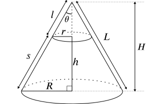

```{r, echo = F}
library(ggplot2)
```

Our party was at a lake.  We wanted to reach the dragon's lair at the bottom of the lake, but we were reluctant to swim that far.  We decided to put a teleportation circle at the bottom of the lake, and link it to a teleportation circle at the prison where our friend was being held.  We were able to keep the teleportation circles open for only 36 seconds.

**Question:** How deep will the lake be after 36 seconds?

# Size of the lake

My first thought was to model the lake as a spherical cap, but the equations for the volume of a spherical cap are hard to work with.  Let's try something else.

Instead, we model the lake as the frustum of a right circular cone (i.e., a cone with the tip chopped off).  The small end of the frustum (with radius $r$) is the bottom of the lake; the large end (with radius $R$) is the initial surface of the lake.



We can relate the volume $V$ of the frustum, its height $h$, and its radii $r$ and $R$ as follows:

$$V = \frac{\pi h}{3} (R^2 + Rr + r^2)$$

The initial dimensions of the lake, as supplied by the DM, were as follows:

```{r, echo = F}
meters_per_foot = 0.3048
V_i_orig = 31000
V_i = V_i_orig * (meters_per_foot ^ 3)
```
$$V_i = `r prettyNum(V_i_orig, big.mark = ",")` \mbox{ ft}^3 = `r signif(V_i, 2)` \mbox{ m}^3$$

```{r, echo = F}
h_i_orig = 50
h_i = h_i_orig * meters_per_foot
```
$$h_i = `r h_i_orig` \mbox{ ft} = `r signif(h_i, 2)` \mbox{ m}$$

```{r, echo = F}
R_i_orig = 20
R_i = R_i_orig * meters_per_foot
```
$$R_i = `r R_i_orig` \mbox{ ft} = `r signif(R_i, 2)` \mbox{ m}$$

Solving for $r_i$, we obtain

$$\frac{\pi h_i}{3}r_i^2 + \frac{\pi h_iR_i}{3}r_i + \frac{\pi h_iR_i^2}{3} - V = 0$$
```{r, echo = F}
a = (pi * h_i) / 3
b = (pi * h_i * R_i) / 3
c = ((pi * h_i * (R_i ^ 2)) / 3) - V_i
r_i = ((-1 * b) + sqrt((b ^ 2) - (4 * a * c))) / (2 * a)
```

Applying the quadratic equation yields $r_i = `r signif(r_i, 2)` \mbox{ m}$.

As water drains from the lake, $r$ remains constant, but $V$, $h$, and $R$ all change.  However, the angle $\theta$ also remains constant, and this allows us to express $R$ as a function of $r_i$ and $h$, thus eliminating one variable.  If $\theta$ is the angle of a right triangle with sides $h$ and $R - r$, then

```{r, echo = F}
tan_theta = (R_i - r_i) / h_i
theta_degrees = (atan(tan_theta) * 180) / pi
```
$$\tan{\theta} = \frac{R - r}{h} = \frac{R_i - r_i}{h_i} = `r signif(tan_theta, 2)`$$

(Incidentally, this means that $\theta = `r signif(theta_degrees, 2)`^{\circ}$.  The lake has very steep sides.)  Since $\theta$ is constant, then at any point in time, $R = r_i + h\tan{\theta}$.

# Speed of water draining from the lake

According to the internet, the rate of volume flow from an opening in a container of liquid is

$$v = C_vC_cA\sqrt{2gh}$$
```{r, echo = F}
C_v = 0.98
C_c = 0.9
A_i_orig = 5 ^ 2
A_i = A_i_orig * (meters_per_foot ^ 2)
g = 9.8
```

where $v$ is the rate of volume flow from the container, $C_v$ is the velocity coefficient of water ($`r C_v`$), $A$ is the area of the opening ($`r signif(A_i, 2)` \mbox{ m}^2$ for a five-foot square), $g$ is the acceleration due to gravity ($`r g` \mbox{ m}/\mbox{s}^2$), and $h$ is the height of the water above the opening (in our case, the depth of the lake).  $C_c$ is the "contraction coefficient": 0.62 for an opening with a sharp edge, 0.97 for an opening with a rounded edge.  Let's go with $C_c = `r C_c`$.

$v$ is a function of $h$, which is itself a function of $V$.  If we can express $v$ as a function of $V$, then we have a first-order differential equation.  As a first step, let's try to express $h$ as a function of $V$.  If we substitute $r_i + h\tan{\theta}$ for $R$ in the volume equation above, we obtain the following cubic equation for $h$:

```{r, echo = F}
a = (pi * (tan_theta ^ 2)) / 3
b = pi * r_i * tan_theta
c = pi * (r_i ^ 2)
```
$$(\frac{\pi \tan^2{\theta}}{3})h^3 + (\pi r_i \tan{\theta})h^2 + (\pi r_i^2)h - V = 0$$

$$`r signif(a, 2)`h^3 + `r signif(b, 2)`h^2 + `r signif(c, 2)`h - V = 0$$

The cubic equation has an analytical solution, but it's horrendous.  We could try plugging that solution back into the volume flow equation, but I have no hope of solving that differential equation analytically.  On to numerical methods!

# Modeling water draining from the lake

```{r, echo = F}
H = function(V) {
  a = (pi * (tan_theta ^ 2)) / 3
  b = pi * r_i * tan_theta
  c = pi * (r_i ^ 2)
  d = V * -1
  x = (((-1 * b) ^ 3) / (27 * (a ^ 3))) + ((b * c) / (6 * (a ^ 2))) - (d / (2 * a))
  y = ((c / (3 * a)) - ((b ^ 2) / (9 * (a ^ 2)))) ^ 3
  z = ((x ^ 2) + y) ^ (1 / 2)
  h = ((x + z) ^ (1 / 3)) + ((x - z) ^ (1 / 3)) - (b / (3 * a))
  return(h)
}
v_flow = function(V, contraction_coefficient) {
  v = C_v * contraction_coefficient * A_i * sqrt(2 * g * H(V))
  return(v)
}
```
Let $H(V)$ be the horrendous function that gives the height $h$ of the lake as a function of its volume.  I'll let R do all those calcuations.

```{r, echo = F, warning = F}
simulate_drain = function(interval_size, contraction_coefficient) {
  intervals = seq(0, 36, interval_size)
  volumes = c()
  for(interval in intervals) {
    if(interval == 0) {
      initial_volume = V_i
    }
    else {
      initial_volume = volumes[length(volumes)]
    }
    removed_volume = v_flow(initial_volume, contraction_coefficient) * interval_size
    new_volume = initial_volume - removed_volume
    volumes = c(volumes, new_volume)
  }
  volume.data = data.frame(Time = intervals, Volume = volumes)
  return(volume.data)
}
```
Let's divide our 36-second period into 1-second intervals.  During each interval, the volume flow is constant and depends on the volume at the beginning of the interval.

```{r, echo = F, warning = F, fig.height = 2.5, fig.width = 5}
volume.data = simulate_drain(1, C_c)
ggplot(volume.data, aes(x = Time, y = Volume)) +
  geom_line()
```

How do things look different if our intervals are 0.1 seconds long instead of 1 second?

```{r, echo = F, warning = F, fig.height = 2.5, fig.width = 5}
volume.data = simulate_drain(.1, C_c)
ggplot(volume.data, aes(x = Time, y = Volume)) +
  geom_line()
```

What about 0.01 seconds?

```{r, echo = F, warning = F, fig.height = 2.5, fig.width = 5}
volume.data = simulate_drain(.01, C_c)
ggplot(volume.data, aes(x = Time, y = Volume)) +
  geom_line()
```

As the size of the intervals decreases, our simulation becomes more accurate.  Clearly, we are converging on a total time of about 36 seconds to fully drain the lake.

**Preliminary conclusion:** We should have pretty much drained the whole lake in 36 seconds.

# But wait -- how sharp is the edge of the opening?

If the hole of the teleportation circle has a sharp edge rather than a rounded one, then $C_c$ should be smaller, and therefore the water should drain more slowly.  We don't know exactly what kind of hole the teleportation circle would make, but a sharp edge actually seems pretty reasonable.  What does the simulation with 0.01-second intervals look like if we posit $C_c = 0.62$?

```{r, echo = F, warning = F, fig.height = 2.5, fig.width = 5}
volume.data = simulate_drain(.01, 0.62)
ggplot(volume.data, aes(x = Time, y = Volume)) +
  geom_line()
```

The lake doesn't fully drain in 36 seconds.  Its final volume is $`r signif(min(volume.data$Volume), 2)` \mbox{ m}^3$, which translates to a depth of $`r signif(H(min(volume.data$Volume)), 2)` \mbox{ m}$.  That's close to what we did during the actual session.

**Final conclusion:** We got things about right!  Yay.
